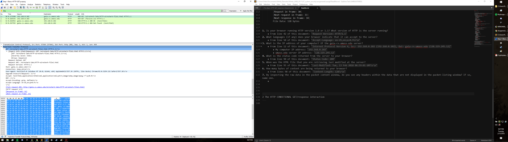
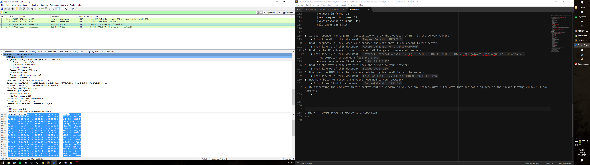
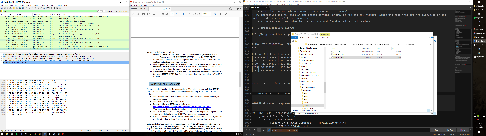
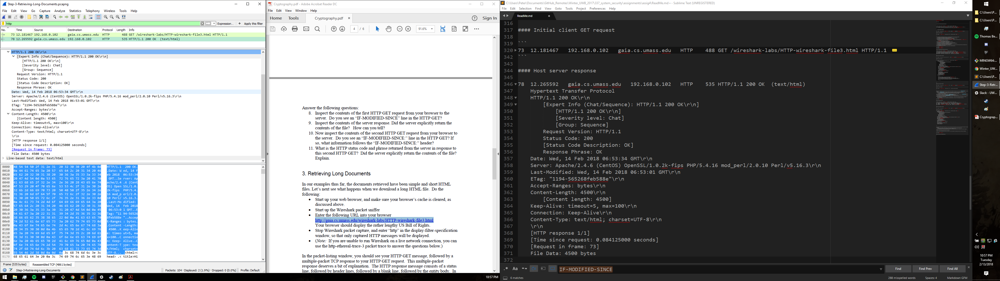

Assignment4: Wireshark Analysis
===

Ryan Peters
---

---
1 The Basic HTTP GET/response interaction
---

    
| frame # | time | source ip address | dest ip address | protocol | length | info |
|:-------:|:----:|:-----------------:|:---------------:|:--------:|:------:|:----:|
| 30 | 0.173390 | 192.168.0.102 | 128.119.245.12 | HTTP | 488 | GET /wireshark-labs/HTTP-wireshark-file1.html HTTP/1.1  |
| 32 | 0.262952 | 128.119.245.12 | 192.168.0.102 | HTTP | 540 | HTTP/1.1 200 OK  (text/html) |

---

#### Initial client GET request

```
30  0.173390    192.168.0.102   gaia.cs.umass.edu   HTTP    488 GET /wireshark-labs/HTTP-wireshark-file1.html HTTP/1.1 
    Internet Protocol Version 4, Src: 192.168.0.102 (192.168.0.102), Dst: gaia.cs.umass.edu (128.119.245.12)
        0100 .... = Version: 4
        .... 0101 = Header Length: 20 bytes (5)
        Differentiated Services Field: 0x00 (DSCP: CS0, ECN: Not-ECT)
            0000 00.. = Differentiated Services Codepoint: Default (0)
            .... ..00 = Explicit Congestion Notification: Not ECN-Capable Transport (0)
        Total Length: 474
        Identification: 0x06d0 (1744)
        Flags: 0x02 (Don't Fragment)
            0... .... = Reserved bit: Not set
            .1.. .... = Don't fragment: Set
            ..0. .... = More fragments: Not set
        Fragment offset: 0
        Time to live: 128
        Protocol: TCP (6)
        Header checksum: 0x0000 [validation disabled]
        [Header checksum status: Unverified]
        Source: 192.168.0.102 (192.168.0.102)
        Destination: gaia.cs.umass.edu (128.119.245.12)
        [Source GeoIP: Unknown]
        [Destination GeoIP: Unknown] 
    Hypertext Transfer Protocol
        GET /wireshark-labs/HTTP-wireshark-file1.html HTTP/1.1\r\n
            [Expert Info (Chat/Sequence): GET /wireshark-labs/HTTP-wireshark-file1.html HTTP/1.1\r\n]
                [GET /wireshark-labs/HTTP-wireshark-file1.html HTTP/1.1\r\n]
                [Severity level: Chat]
                [Group: Sequence]
            Request Method: GET
            Request URI: /wireshark-labs/HTTP-wireshark-file1.html
            Request Version: HTTP/1.1
        Host: gaia.cs.umass.edu\r\n
        Connection: keep-alive\r\n
        User-Agent: Mozilla/5.0 (Windows NT 10.0; Win64; x64) AppleWebKit/537.36 (KHTML, like Gecko) Chrome/63.0.3239.132 Safari/537.36\r\n
        Upgrade-Insecure-Requests: 1\r\n
        Accept: text/html,application/xhtml+xml,application/xml;q=0.9,image/webp,image/apng,*/*;q=0.8\r\n
        DNT: 1\r\n
        Accept-Encoding: gzip, deflate\r\n
        Accept-Language: en-US,en;q=0.9\r\n
        \r\n
        [Full request URI: http://gaia.cs.umass.edu/wireshark-labs/HTTP-wireshark-file1.html]
        [HTTP request 1/2]
        [Response in frame: 32]
        [Next request in frame: 33]
``` 

#### Host server response   
   
```        
32  0.262952    gaia.cs.umass.edu   192.168.0.102   HTTP    540 HTTP/1.1 200 OK  (text/html)
    Internet Protocol Version 4, Src: gaia.cs.umass.edu (128.119.245.12), Dst: 192.168.0.102 (192.168.0.102)
        0100 .... = Version: 4
        .... 0101 = Header Length: 20 bytes (5)
        Differentiated Services Field: 0x20 (DSCP: CS1, ECN: Not-ECT)
            0010 00.. = Differentiated Services Codepoint: Class Selector 1 (8)
            .... ..00 = Explicit Congestion Notification: Not ECN-Capable Transport (0)
        Total Length: 526
        Identification: 0x8a15 (35349)
        Flags: 0x02 (Don't Fragment)
            0... .... = Reserved bit: Not set
            .1.. .... = Don't fragment: Set
            ..0. .... = More fragments: Not set
        Fragment offset: 0
        Time to live: 46
        Protocol: TCP (6)
        Header checksum: 0x8a22 [validation disabled]
        [Header checksum status: Unverified]
        Source: gaia.cs.umass.edu (128.119.245.12)
        Destination: 192.168.0.102 (192.168.0.102)
        [Source GeoIP: Unknown]
        [Destination GeoIP: Unknown]
    Hypertext Transfer Protocol
        HTTP/1.1 200 OK\r\n
            [Expert Info (Chat/Sequence): HTTP/1.1 200 OK\r\n]
                [HTTP/1.1 200 OK\r\n]
                [Severity level: Chat]
                [Group: Sequence]
            Request Version: HTTP/1.1
            Status Code: 200
            [Status Code Description: OK]
            Response Phrase: OK
        Date: Wed, 14 Feb 2018 04:21:07 GMT\r\n
        Server: Apache/2.4.6 (CentOS) OpenSSL/1.0.2k-fips PHP/5.4.16 mod_perl/2.0.10 Perl/v5.16.3\r\n
        Last-Modified: Tue, 13 Feb 2018 06:59:01 GMT\r\n
        ETag: "80-56512878d164b"\r\n
        Accept-Ranges: bytes\r\n
        Content-Length: 128\r\n
            [Content length: 128]
        Keep-Alive: timeout=5, max=100\r\n
        Connection: Keep-Alive\r\n
        Content-Type: text/html; charset=UTF-8\r\n
        \r\n
        [HTTP response 1/2]
        [Time since request: 0.089562000 seconds]
        [Request in frame: 30]
        [Next request in frame: 33]
        [Next response in frame: 34]
        File Data: 128 bytes  
```  

---

1. Is your browser running HTTP version 1.0 or 1.1? What version of HTTP is the server running?
    + From line 42 of this document: `Request Version: HTTP/1.1` 
2. What languages (if any) does your browser indicate that it can accept to the server?
    + From line 50 of this document: `Accept-Language: en-US,en;q=0.9\r\n`
3. What is the IP address of your computer? Of the gaia.cs.umass.edu server?
    + From line 12 of this document: `Internet Protocol Version 4, Src: 192.168.0.102 (192.168.0.102), Dst: gaia.cs.umass.edu (128.119.245.12)`
        + My computer IP address: `192.168.0.102`
        + umass.edu server IP address: `128.119.245.12`
4. What is the status code returned from the server to your browser?
    + From line 90 of this document: `Status Code: 200`
5. When was the HTML file that you are retrieving last modified at the server?
    + From line 95 of this document: `Last-Modified: Tue, 13 Feb 2018 06:59:01 GMT\r\n`
6. How many bytes of content are being returned to your browser?
    + From lines 98 of this document: `Content-Length: 128\r\n`
7. By inspecting the raw data in the packet content window, do you see any headers within the data that are not displayed in the packet-listing window? If so, name one.
    + I checked each hex value in the raw data and found no additional headers.





---
2 The HTTP CONDITIONAL GET/response interaction
---

| frame # | time | source ip address | dest ip address | protocol | length | info |
|:-------:|:----:|:-----------------:|:---------------:|:--------:|:------:|:----:|
| 67 | 20.044479 | 192.168.0.102 | 128.119.245.12 | HTTP | 488 |  GET /wireshark-labs/HTTP-wireshark-file2.html HTTP/1.1  |
| 69 | 20.044479 | 128.119.245.12 | 192.168.0.102 | HTTP | 784 | HTTP/1.1 200 OK  (text/html) |
|235| 38.303059   |192.168.0.102   |128.119.245.12   |HTTP    |600| GET /wireshark-labs/HTTP-wireshark-file2.html HTTP/1.1|
|237| 38.394623   |128.119.245.12|   192.168.0.102|   HTTP    |294| HTTP/1.1 304 Not Modified|

---

#### Initial client GET request

```
67  20.044479   192.168.0.102   128.119.245.12  HTTP    488 GET /wireshark-labs/HTTP-wireshark-file2.html HTTP/1.1 
    Hypertext Transfer Protocol
        GET /wireshark-labs/HTTP-wireshark-file2.html HTTP/1.1\r\n
            [Expert Info (Chat/Sequence): GET /wireshark-labs/HTTP-wireshark-file2.html HTTP/1.1\r\n]
                [GET /wireshark-labs/HTTP-wireshark-file2.html HTTP/1.1\r\n]
                [Severity level: Chat]
                [Group: Sequence]
            Request Method: GET
            Request URI: /wireshark-labs/HTTP-wireshark-file2.html
            Request Version: HTTP/1.1
        Host: gaia.cs.umass.edu\r\n
        Connection: keep-alive\r\n
        User-Agent: Mozilla/5.0 (Windows NT 10.0; Win64; x64) AppleWebKit/537.36 (KHTML, like Gecko) Chrome/63.0.3239.132 Safari/537.36\r\n
        Upgrade-Insecure-Requests: 1\r\n
        Accept: text/html,application/xhtml+xml,application/xml;q=0.9,image/webp,image/apng,*/*;q=0.8\r\n
        DNT: 1\r\n
        Accept-Encoding: gzip, deflate\r\n
        Accept-Language: en-US,en;q=0.9\r\n
        \r\n
        [Full request URI: http://gaia.cs.umass.edu/wireshark-labs/HTTP-wireshark-file2.html]
        [HTTP request 1/2]
        [Response in frame: 69]
        [Next request in frame: 71]
```

#### Host server response

```
69  20.131291   128.119.245.12  192.168.0.102   HTTP    784 HTTP/1.1 200 OK  (text/html)
    Hypertext Transfer Protocol
        HTTP/1.1 200 OK\r\n
            [Expert Info (Chat/Sequence): HTTP/1.1 200 OK\r\n]
                [HTTP/1.1 200 OK\r\n]
                [Severity level: Chat]
                [Group: Sequence]
            Request Version: HTTP/1.1
            Status Code: 200
            [Status Code Description: OK]
            Response Phrase: OK
        Date: Wed, 14 Feb 2018 05:17:35 GMT\r\n
        Server: Apache/2.4.6 (CentOS) OpenSSL/1.0.2k-fips PHP/5.4.16 mod_perl/2.0.10 Perl/v5.16.3\r\n
        Last-Modified: Tue, 13 Feb 2018 06:59:01 GMT\r\n
        ETag: "173-56512878d0e7b"\r\n
        Accept-Ranges: bytes\r\n
        Content-Length: 371\r\n
            [Content length: 371]
        Keep-Alive: timeout=5, max=100\r\n
        Connection: Keep-Alive\r\n
        Content-Type: text/html; charset=UTF-8\r\n
        \r\n
        [HTTP response 1/2]
        [Time since request: 0.086812000 seconds]
        [Request in frame: 67]
        [Next request in frame: 71]
        [Next response in frame: 72]
        File Data: 371 bytes
    Line-based text data: text/html
        \n
        <html>\n
        \n
        Congratulations again!  Now you've downloaded the file lab2-2.html. <br>\n
        This file's last modification date will not change.  <p>\n
        Thus  if you download this multiple times on your browser, a complete copy <br>\n
        will only be sent once by the server due to the inclusion of the IN-MODIFIED-SINCE<br>\n
        field in your browser's HTTP GET request to the server.\n
        \n
        </html>\n

```

---
---

#### Second client GET request

```
235 38.303059   192.168.0.102   gaia.cs.umass.edu   HTTP    600 GET /wireshark-labs/HTTP-wireshark-file2.html HTTP/1.1 
    Hypertext Transfer Protocol
        GET /wireshark-labs/HTTP-wireshark-file2.html HTTP/1.1\r\n
            [Expert Info (Chat/Sequence): GET /wireshark-labs/HTTP-wireshark-file2.html HTTP/1.1\r\n]
                [GET /wireshark-labs/HTTP-wireshark-file2.html HTTP/1.1\r\n]
                [Severity level: Chat]
                [Group: Sequence]
            Request Method: GET
            Request URI: /wireshark-labs/HTTP-wireshark-file2.html
            Request Version: HTTP/1.1
        Host: gaia.cs.umass.edu\r\n
        Connection: keep-alive\r\n
        Cache-Control: max-age=0\r\n
        User-Agent: Mozilla/5.0 (Windows NT 10.0; Win64; x64) AppleWebKit/537.36 (KHTML, like Gecko) Chrome/63.0.3239.132 Safari/537.36\r\n
        Upgrade-Insecure-Requests: 1\r\n
        Accept: text/html,application/xhtml+xml,application/xml;q=0.9,image/webp,image/apng,*/*;q=0.8\r\n
        DNT: 1\r\n
        Accept-Encoding: gzip, deflate\r\n
        Accept-Language: en-US,en;q=0.9\r\n
        If-None-Match: "173-56512878d0e7b"\r\n
        If-Modified-Since: Tue, 13 Feb 2018 06:59:01 GMT\r\n
        \r\n
        [Full request URI: http://gaia.cs.umass.edu/wireshark-labs/HTTP-wireshark-file2.html]
        [HTTP request 1/1]
        [Response in frame: 237]
```

#### Host server response

```
237 38.394623   gaia.cs.umass.edu   192.168.0.102   HTTP    294 HTTP/1.1 304 Not Modified 
    Hypertext Transfer Protocol
        HTTP/1.1 304 Not Modified\r\n
            [Expert Info (Chat/Sequence): HTTP/1.1 304 Not Modified\r\n]
                [HTTP/1.1 304 Not Modified\r\n]
                [Severity level: Chat]
                [Group: Sequence]
            Request Version: HTTP/1.1
            Status Code: 304
            [Status Code Description: Not Modified]
            Response Phrase: Not Modified
        Date: Wed, 14 Feb 2018 05:17:53 GMT\r\n
        Server: Apache/2.4.6 (CentOS) OpenSSL/1.0.2k-fips PHP/5.4.16 mod_perl/2.0.10 Perl/v5.16.3\r\n
        Connection: Keep-Alive\r\n
        Keep-Alive: timeout=5, max=100\r\n
        ETag: "173-56512878d0e7b"\r\n
        \r\n
        [HTTP response 1/1]
        [Time since request: 0.091564000 seconds]
        [Request in frame: 235]
```

---

8. Inspect the contents of the first HTTP GET request from your browser to the server. Do you see an “IF-MODIFIED-SINCE” line in the HTTP GET?
    + No, The `IF-MODIFIED-SINCE` line doesn't appear in any frame until `frame#235` when the page was refreshed.
9. Inspect the contents of the server response. Did the server explicitly return the contents of the file? How can you tell?
    + Yes it did, because its response included an observable file that was 371 bytes in length.
        + See line 205 of this document.
10. Now inspect the contents of the second HTTP GET request from your browser to the server. Do you see an “IF-MODIFIED-SINCE:” line in the HTTP GET? If so, what information follows the “IF-MODIFIED-SINCE:” header?
    + From line 257 of this document: `If-Modified-Since: Tue, 13 Feb 2018 06:59:01 GMT\r\n`
11. What is the HTTP status code and phrase returned from the server in response to this second HTTP GET? Did the server explicitly return the contents of the file? Explain.
    + from lines 275, 276, and 277 of this document: `Status Code: 304`, `[Status Code Description: Not Modified]`, `Response Phrase: Not Modified`
    + No, the server did not return the contents of the unmodified file. There was no file attached to this frame.



---
3 Retrieving Long Documents
---
    
| frame # | time | source ip address | dest ip address | protocol | length | info |
|:-------:|:----:|:-----------------:|:---------------:|:--------:|:------:|:----:|
|73|  12.181467|   192.168.0.102|   128.119.245.12|   HTTP|    488| GET /wireshark-labs/HTTP-wireshark-file3.html HTTP/1.1 |
|78|  12.265592|   128.119.245.12|   192.168.0.102|   HTTP|    535| HTTP/1.1 200 OK  (text/html)|

---

#### Initial client GET request

```
73  12.181467   192.168.0.102   gaia.cs.umass.edu   HTTP    488 GET /wireshark-labs/HTTP-wireshark-file3.html HTTP/1.1 
    Hypertext Transfer Protocol
        GET /wireshark-labs/HTTP-wireshark-file3.html HTTP/1.1\r\n
            [Expert Info (Chat/Sequence): GET /wireshark-labs/HTTP-wireshark-file3.html HTTP/1.1\r\n]
                [GET /wireshark-labs/HTTP-wireshark-file3.html HTTP/1.1\r\n]
                [Severity level: Chat]
                [Group: Sequence]
            Request Method: GET
            Request URI: /wireshark-labs/HTTP-wireshark-file3.html
            Request Version: HTTP/1.1
        Host: gaia.cs.umass.edu\r\n
        Connection: keep-alive\r\n
        User-Agent: Mozilla/5.0 (Windows NT 10.0; Win64; x64) AppleWebKit/537.36 (KHTML, like Gecko) Chrome/63.0.3239.132 Safari/537.36\r\n
        Upgrade-Insecure-Requests: 1\r\n
        Accept: text/html,application/xhtml+xml,application/xml;q=0.9,image/webp,image/apng,*/*;q=0.8\r\n
        DNT: 1\r\n
        Accept-Encoding: gzip, deflate\r\n
        Accept-Language: en-US,en;q=0.9\r\n
        \r\n
        [Full request URI: http://gaia.cs.umass.edu/wireshark-labs/HTTP-wireshark-file3.html]
        [HTTP request 1/1]
        [Response in frame: 78]
```

#### Host server response

```
78  12.265592   gaia.cs.umass.edu   192.168.0.102   HTTP    535 HTTP/1.1 200 OK  (text/html)
    Hypertext Transfer Protocol
    HTTP/1.1 200 OK\r\n
        [Expert Info (Chat/Sequence): HTTP/1.1 200 OK\r\n]
            [HTTP/1.1 200 OK\r\n]
            [Severity level: Chat]
            [Group: Sequence]
        Request Version: HTTP/1.1
        Status Code: 200
        [Status Code Description: OK]
        Response Phrase: OK
    Date: Wed, 14 Feb 2018 06:53:34 GMT\r\n
    Server: Apache/2.4.6 (CentOS) OpenSSL/1.0.2k-fips PHP/5.4.16 mod_perl/2.0.10 Perl/v5.16.3\r\n
    Last-Modified: Wed, 14 Feb 2018 06:53:01 GMT\r\n
    ETag: "1194-565268feb588e"\r\n
    Accept-Ranges: bytes\r\n
    Content-Length: 4500\r\n
        [Content length: 4500]
    Keep-Alive: timeout=5, max=100\r\n
    Connection: Keep-Alive\r\n
    Content-Type: text/html; charset=UTF-8\r\n
    \r\n
    [HTTP response 1/1]
    [Time since request: 0.084125000 seconds]
    [Request in frame: 73]
    File Data: 4500 bytes
```

---


12. How many HTTP GET request messages did your browser send? Which packet number in the trace contains the GET message for the Bill of Rights?
    + I don't think this section of the lab is up to date; I've only got a single `GET` request and the full contents of the returned file came on a single frame.
13. Which packet number in the trace contains the status code and phrase associated with the response to the HTTP GET request?
    + 
14. What is the status code and phrase in the response?
    + 
15. How many data-containing TCP segments were needed to carry the single HTTP response and the text of the Bill of Rights?
    + 



---
4 HTML Documents with Embedded Objects
---
