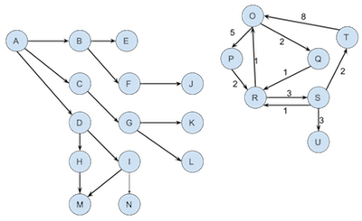

---
title: "Ass 3"
output:
  html_document

---

**DRAFT** -- Some small changes might happen by Feb 1st. Any changes will be highlighted.

**Due:**  11pm, 11 Feb (end of week 6)

### Graph Program

Implement a Graph class on the template below and test your class for depth-first search, breadth-first search and in djikstra's shortest path.

All the public functions for Vertex, Edge and Graph have to be implemented. You can change the private variables and functions as needed. Your program shoulkd compile and run against ass3.cpp provided. You should write your own expanded version of ass3.

[vertex.h](code/ass3/vertex.h), [vertex.cpp](code/ass3/vertex.cpp), 
[edge.h](code/ass3/edge.h), [edge.cpp](code/ass3/edge.cpp), 
[graph.h](code/ass3/graph.h), [graph.cpp](code/ass3/graph.cpp), 
[ass3.cpp](code/ass3/ass3.cpp)

Sample graph files: [graph0.txt](code/ass3/graph0.txt), [graph1.txt](code/ass3/graph1.txt), [graph2.txt](code/ass3/graph2.txt),

## Pseudocode

graph2.txt as provided

AdjacencyList for the vertex is sorted alphabetically (map already does this for us), so the edge from `S to T` gets processed before the edge from `S to U`. `getNextNeighbor` returns `T` before `U`



### Depth-first search

Can be done recursively or iteratively. 

Recursive version:
```C
Mark all nodes as unvisited
call dfsHelper with startVertex

dfsHelper: vertex
visit vertex
getNextNeighbor of vertex as n
if n is not visited
  call dfsHelper with n
```

Iterative version:
```C
Mark all nodes as unvisited
push v onto stack
while stack is not empty
  if there is a neighbor for the vertex on top of the stack that has not been visited
      push neighbor onto stack
      visit neighbor
  else
      no unvisited neighbor
      pop stack
```

```
Starting from O gives the following visiting order:  
O P R S T U Q
```
### Breadth-first search
```C
Mark all nodes as unvisited
enqueue startVertex to queue
mark startVertex as visited
while queue is not empty
    w = dequeue
    for each unvisited neighbor u of w
        visit u
        enqueue u
```
```
Starting from O gives the following visiting order:  
O P Q R S T U
```

### Djikstra's shortest path
```C
create a priority queue, pq to keep total cost to vertex
for all neighbors u of startVertex
    weight[u] = weight of edge from startVertex to u
    previous[u] = w
    pq add (u, weight[u])
add startVertex to vertexSet
while pq is not empty
    v = get vertex with lowest weight from pq
    if v is not in vertexSet
        for each neighbor u of v
            v2ucost = get edge cost to go from v to u
            if there is no weight[u] 
                  // we could not get to u before
                  // this is the only path
                  weight[u] = weight[v] + v2ucost;
                  previous[u] = v;
                  pq add (u, weight[u])
            else
                // we could get to to u before
                // is going via v better?
                if (weight[u] > weight[v] + v2ucost)
                    // yes
                    weight[u] = weight[v] + v2ucost;
                    previous[u] = v;
                    pq add (u, weight[u])
                else
                    // no, previous route was better
                    // do nothing
```

```
Starting from O
weight[P] = 5, weight[Q] = 2
vertexSet = {O}
processing pq { (Q, 2), (P, 5) }
  v = Q
  vertexSet is now {O, Q}
  pq is now { (P, 5) }
  looking at Q's neighbors
    u = R
    weight[R] = 3
    previous[R] = Q
    pq add (R, 3)
processing pq { (R, 3), (P, 5) }
  v = R
  vertexSet is now {O, Q, R}
  looking at R's neighbors
    u = O is visited, skip it
    u = S
    weight[S] = weight[R] + 3 = 6
    previous[S] = R
    pq add (S, 6)
processing pq { (P, 5), (S, 6)}
  v = P
  u = R is visited, skip it
  u = S
  vertexSet is now {O, Q, R, S}
  looking at S's neighbors
    u = T
    weight[T] = weight[S] + 2
    previous[S] = T
    pq add (T, 8)
    // next neighbor
    u = U
    weight[U] = weight[S] + 3
    previous[U] = T
    pq add (U, 9)
processing pq { (T, 8), (U, 9) }
  v = T
  ...
```
## Submissions

As always expected when programming, comment clearly and
thoroughly. Clearly state any assumptions you make in the beginning
comment block of the appropriate place, e.g., the class
definition. Comments in the class definition file should describe the
ADT, all functionality, and assumptions so someone could use the class
and understand behavior and restrictions. Pre and post conditions are
fine, but not required. See the example on Assignments page for a well-documented program.

You do NOT need to handle data type errors due to bad input.

I will run my own main to test your code. The `main` function provided
doesn't test your program fully, so you need to supplement it.

Write one function at a time. Test it before moving on to the next
function. I suggest starting with `add` Use `valgrind` to check
for memory leaks as you develop the program. Much easier to fix things
early on.

Submit a single zip file, `ass3.zip` with the following files:

**Class names start with capital letters, but file names are all lowercase for compatibility** 

`vertex.h`, `vertex.cpp`, `edge.h`, `edge.cpp`, `graph.h`, `graph.cpp`  
`ass3.cpp` -- your own testing functions and main  
`output.txt` - the script file, as defined in [Connecting and compiling files on linux labs](http://faculty.washington.edu/pisan/cpp/linux-labs.html)  
`comments.txt` - your comments.  Includes several bits of information

1. "Hours: XX" where XX is approximate number of hours it took you to complete this assignment

2. "Comments: " Optional comments, weird compiler error messages you got
   while developping, problems in setting things up etc. This is
   intended as *for your information*. If you want a response from me,
   email me instead.


Once your code is working on your own machine, test it once more on
the linux machines (you have been testing incrementally and using
`valgrind`, right?). See [Connecting and compiling files on linux
labs](http://faculty.washington.edu/pisan/cpp/linux-labs.html)

Under unix, compile your code using
```
g++ -std=c++14 -g -Wall -Wextra vertex.cpp edge.cpp graph.cpp ass2.cpp -o ass3
```

and create the `output.txt` file following the instructions.

See [Creating a zip file](http://faculty.washington.edu/pisan/cpp/creating-zip.html) under
[Assignments](assignments.html) on how to create and test your zip
file. See the sample program on Assignments on how to properly document your code.

## Submission

```
Submit your assignment early to get automated feedback from Jolly.

Your submission must be named ass3.zip

Your submission must create a directory called ass3 and 
place all the files in that directory when it is unzipped.

DO NOT include unnecessary files, 
only submit what is required. 

DO NOT zip up your Debug directory, your project directory, etc.

Canvas will automatically rename your zip file ass3-2.zip, ass3-3.zip, etc 
depending on how many times you submit it. 

*This is fine*. Do not change your zip file name.
```

## Grading Rubric

I will run automated tests on Wednesday 10pm and Friday 10pm. If you submit your assignment before that you will get an email from "JollyFeedback" The tests are not exhaustive, but should help you.

Multiple criteria. -5 for partially correct, -10 for not working or missing 

```
1. depth-first search
2. breadth-first search
3. djikstra's shortest path
4. Vertex functions, especially getNextNeighbor
6. Graph destructor
7. Graph functions not mentioned above, especially ~Graph
8. efficiency and complexity
9. comments.txt - tested on CSS Linux Labs
10. Coding style + ass3.zip constructed properly - all lines less than 80 characters, some exceptions are OK...
```
