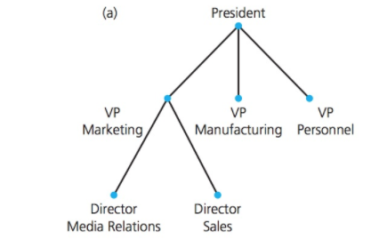

Lecture 1 notes: Introduction & Trees
===

Created By: Yusuf Pisan
---

formatted to Github Markdown syntax by Ryan Peters

## Be sure to check the other lectures out after you finish this one!

[Next lecture](https://ryancpeters.github.io/Winter_UWB_2017/343_data-structures_n_algos/lectureNotes/lecture2/)

---

### Table of Contents
  
  1. Introduction and Trees
  2. [Overview](#overview)
  3. [342 Review](#342-review)
  4. [Reading Code (1)](#reading-code-1)
  5. [Reading Code (2)](#reading-code-2)
  6. [Reading Code (3)](#reading-code-3)
  7. [Reading Code (4)](#reading-code-4)
  8. [Reading Code (5)](#reading-code-5)
  9. [Trees](#trees)
  10. [Algebraic Expression](#algebraic-expression)
  11. [Binary Search Tree](#binary-search-tree)
  12. [After Class](#after-class)

[1]:#table-of-contents "Back to Table of Contents"

[Overview][1]
===

http://courses.washington.edu/css343/pisan/

+ Syllabus
  - Contact Info, Office Hours
  - Textbooks
  - Grading
  - Weekly Schedule
  - Resources

+ About me

+ Readings before class


[342 Review][1]
===

- Searching & Sorting
- Recursion
- Templates, STL
- Binary Search Tree
- Pointers, Linked Lists
- Stacks (LIFO), Queues (FIFO)
- Algorithm Analysis

Order them based on your level of comfort  
https://pollev.com/pisan

[Reading Code (1)][1]
===
Somebody forgot to write comments! 

```C++++
int foo(int n)
{
   if (n == 0)
      return 1;
   else
      return n * foo(n - 1);
}
```

What is its complexity? Why?

[Reading Code (2)][1]
===
  
```C++
int mystery(const int anArray[], int first, int last, int target)
{
   int index;
   if (first > last)
      index = -1;
   else
   {
      int mid = first + (last - first) / 2;
      if (target == anArray[mid])
         index = mid;
      else if (target < anArray[mid])
         index = mystery(anArray, first, mid - 1, target);
      else
         index = mystery(anArray, mid + 1, last, target);
   }
   return index;
}
```


What is its complexity? Why?

[Reading Code (3)][1]
=======
  
```C++
template<class ItemType>
bool Grouch<ItemType>::mumble(const ItemType& newEntry)
{
   Node<ItemType>* nextNodePtr = new Node<ItemType>();
   nextNodePtr->setItem(newEntry);
   nextNodePtr->setNext(headPtr);

   headPtr = nextNodePtr;          
   itemCount++;
   
   return true;
}  // end add
```


What is its complexity? Why?

[Reading Code (4)][1]
===========
SomeInterface, but what?
  
```C++
template<class ItemType>
class SomeInterface
{
public:
   virtual bool isEmpty() const = 0;
   virtual bool push(const ItemType& newEntry) = 0;
   virtual bool pop() = 0;
   virtual ItemType peek() const = 0;
   virtual ~SomeInterface() {  }
};
```


[Reading Code (5)][1]
==========================
  
```C++
template<class ItemType>
void someSort(ItemType theArray[], int n)
{
   bool sorted = false;
   int pass = 1;
   while (!sorted && (pass < n))
   {
      sorted = true;
      for (int index = 0; index < n - pass; index++)
      {
         int nextIndex = index + 1;
         if (theArray[index] > theArray[nextIndex])
         {
            std::swap(theArray[index], theArray[nextIndex]);
            sorted = false; // Signal exchange
         } // end if
      }  // end for
      
      pass++;
   }  // end while
}  // end someSort
```


What is its complexity? Why?

[Trees][1]
===


+ Single root, hierarchical - more than one immediate successor
+ nodes, edges
+ child, parent, sibling, ancestor, descendant
+ subtree
+ general, n-ary, binary tree
+ height (root at level 1, empty tree has height 0)


[Algebraic Expression][1]
====


Representing ``` (a - b) x c```

+ Traversal
  + *preorder* - root, left, right  
  + *inorder* - left, root, right  
  + *postorder* - left, right, root

Let's try different traversals.

Group Exercise: `((a + b) * (c + d)) / (e * f) - g`


[Binary Search Tree][1]
===============

```C++
search(BST, target)
  if (BST is empy)
    item not found
  else if target == data in BST
    item found
  else if target < data
    search(left subtree, target)
  else
    search(right subtree, target)
```

What is the worst case complexity for a badly constructed tree?

Create a balanced BST for A, B, C, D, E, F


[After Class][1]
=============

Explore the Resources on course pages

Read/Review Binary Search Trees

Read Math (Rosen) 11.1-3 (available under Resources)

Logon to #slack https://css-uwb.slack.com/ join #343 and give an example of a programming error that you tend to make

Assignment 1: TurtleProgram  
  - Abstract Data Type (ADT) defines behavior.   
  - Data Structure is a concrete implementation of ADT  
  - Ask questions - but you have to debug your own code

Start programming 
