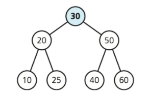

Lecture 2: Huffman Coding
===
Created By: Yusuf Pisan
---
formatted to Github Markdown syntax by Ryan Peters

<div class=" slidy_toc hidden">
  <div class=" toc-heading"><h5>Table of Contents</h5></div>

- [Huffman Coding](#huffman-coding)
- [Overview ](#overview)
- [Assignment 1: TurtleProgram](#assignment-1-turtleprogram)
- [Common Programming Mistakes](#common-programming-mistakes)
- [Binary Search Tree - Definition](#binary-search-tree---definition)
  - [Binary Search Tree](#binar-search-tree)
  - [UML for Binary Tree](#uml-for-binary-tree)
  - [Why Trees?](#Why-Trees)
    - [Group Exercise: Prove](#Group-Exercise-Prove)
    - [Group Exercise: Prove - Solution](#group-exercise-prove---solution)
    - [Group Exercise: Insert Elements](#Group-Exercise-Insert-Elements)
- [Tree as Array](#Tree-as-Array)
  - [Group Exercise: Array Representation](#Group-Exercise-Array-Representation)
- [Tree as Linked Nodes](#tree-as-linked-nodes)
- [Smart Pointers](#smart-pointers)
  - [Group Exercise: Order of Inserts](#group-exercise-order-of-inserts)
- [Huffman Coding](#huffman-coding)
  - [Huffman Coding - Algorithm](#huffman-coding---algorithm)
- [After Class](#after-class)

[Overview][1]<meta name="copyright" content="Yusuf Pisan | pisan@uw.edu | http://courses.washington.edu/css343/" /><meta name="duration" content="120" />
===

+ Review - Ass1, BST, Complexity Analysis (worksheet later)

+ Common programming mistakes

+ Binary Search Trees

+ Huffman Coding

+ See IDE Tips, email me tips!

[Assignment 1: TurtleProgram][1]
===

Each program is a series of strings (comes as 2 strings at a time)

Draw the UML Class Diagram - public functions, private variables

Write the constructors and `<<` so you can easily display them

You are overloading multiple operators `<< == != = + +=`

Signature must match (friend functions)

Remember to dynamically allocate the array to be just the right size (not `string[100]`)

- Optional: Smart pointers
    - Use unique_ptr for arrays, shared_ptr most other times

[Common Programming Mistakes][1]
===

Use compiler flags `-Wall -Wextra -Wpedantic -Weffc++` and even `-Werror`

Review code examples: http://faculty.washington.edu/pisan/cpp/snippets.html

[Binary Search Tree - Definition][1]
===

+ Left child value less than parent

+ Right child value greater than parent

+ Assume no duplicates

Inserting items from a sorted list?

+ Incremental Program Development

Write a BST for `int` in the simplest way possible with only single constructor and `add`.

Use the code from textbook. Generalize it to take any data type, to have proper getters/setters.

Assignment #2 will use Trees.

[Binary Search Tree][1]
===

```C++
search(BST, target)
  if (BST is empy)
    item not found
  else if target == data in BST
    item found
  else if target < data
    search(left subtree, target)
  else
    search(right subtree, target)
```

What is the worst case complexity for a badly constructed tree?

Create a balanced BST for A, B, C, D, E, F

What does it mean for a tree to be balanced, full, complete?

[UML for Binary Tree][1]
====


Implementation choices

- Arrays
- Link-Based

[Why Trees?][1]
===

+ Good for searching when there is both add/delete operations. Used internally for libraries

+ Games use Binary Space Partition, render only what is visible from front to back

+ Radix Trees for IP routing

+ Huffman Coding Tree for compression

+ GGM Trees for generating random numbers

+ Merkle Tree for cryptography

+ Syntax Tree for parsing languages

+ B-Tree for databases

+ Directory structures, web pages, anything hierarchical

[Group Exercise: Prove][1]
===

Prove: A full binary tree of height ≥ 0 has 2<sup>h</sup> - 1 nodes



[Group Exercise: Prove - Solution][1]
===

_Prove:_ A full binary tree of height ≥ 0  has 2<sup>h</sup> - 1 nodes

__*Proof by induction*__

**Basis:**  When h = 0, the full binary tree is empty, and it contains 0 = 2<sup>0</sup> – 1 nodes

**Inductive hypothesis:** Assume that a full binary tree of height k has 2<sup>h</sup> – 1 nodes when 0 ≤ k < h.

**_Inductive conclusion_**

We must show that a full binary tree of height h has 2<sup>h</sup> – 1 nodes

Let’s look at a tree with height `h-1`.
By the inductive hypothesis, T<sub>L</sub> and T<sub>R</sub> each have 2<sup>h-1</sup> – 1 nodes.
The number of nodes in T is

<font size="6" style="font-family:courier;">
1 (for root) + (number of nodes in T<sub>L</sub>) + (number of nodes in T<sub>R</sub>)
= 1 + (2<sup>h-1</sup> – 1) + (2<sup>h-1</sup> – 1)
= 1 + 2 x (2<sup>h-1</sup> – 1)
= 1 + 2<sup>h</sup> - 2
= 2<sup>h</sup> - 1 
</font>

[Group Exercise: Insert Elements][1]
===

Insert the letters in "Huffman Coding" to create a binary search tree

- Skip duplicates, treat all letters as lowercase

- Write out the string that is created for preorder, inorder, postorder

- What is the height of the tree (single root node = 1)

- Can you reduce its height if it is a general tree and not a BST?

[Tree as Array][1]
===

Not the most natural or common, but important

```C++
TreeNode<ItemType> tree[MAX_NODES]; // array of nodes
int root; // index of root
int free; // index of free list
```

```C++
class TreeNode
{   
private:
   ItemType item;        // Data portion
   int      leftChild;   // Index to left child
   int      rightChild;  // Index to right child
}
```


[Group Exercise: Array Representation][1]
===

Represent "Huffman Coding" tree as an array

- Assume insertion order is as before H, u, f, ...

[Tree as Linked Nodes][1]
===


```C++
class BinaryNode
{
private:
   int          item;          // Data portion
   BinaryNode * leftChildPtr;  // Pointer to left child
   BinaryNode * rightChildPtr; // Pointer to right child
}
```

```C++
template<class ItemType>
class BinaryNode
{
private:
   ItemType                              item;          // Data portion
   BinaryNode<ItemType> * leftChildPtr;  // Pointer to left child
   BinaryNode<ItemType> * rightChildPtr; // Pointer to right child
}
```

```C++
template<class ItemType>
class BinaryNode
{
private:
   ItemType                              item;          // Data portion
   shared_ptr<BinaryNode<ItemType>> leftChildPtr;  // Pointer to left child
   shared_ptr<BinaryNode<ItemType>> rightChildPtr; // Pointer to right child
}
```


[Smart Pointers][1]
===

shared_ptr - shared object, does reference counting, similar to regular pointer

unique_ptr - unique ownership, nobody else can reference it

weak_ptr - observer of the object, cannot be used to delete, does not add to reference count

```C++
Box<string> myptr = new Box<string>();
shared_ptr<Box<string>> mysharedptr(new Box<string>());
...
delete myptr;
mysharedptr.reset();
```

If interested, read C++ Interlude 4

Using smart pointers is optional

**Do not** mix smart pointers and regular pointers

[Group Exercise: Order of Inserts][1]
===


If this is our final binary search tree, find at least 2 possible insertion orders.


[Huffman Coding][1]
===

Used for compression (part of the gzip, jpeg and many other algorithm)

Take advantage of repetitions

Assign a code to each letter. Short codes for frequent letters.

ASCII characters are represented as 8-bits. Lots of wasted space.

```
010011011001100110001110001
```

Where does one code begin and the other one end? Need unique prefixes

Extra: Details of gzip using LZ77 and Huffman at http://www.gzip.org/algorithm.txt

and more from Mark Adler (co-author of zlib and gzip)  
https://stackoverflow.com/questions/20762094/how-are-zlib-gzip-and-zip-related-what-do-they-have-in-common-and-how-are-they

[Huffman Coding - Algorithm][1]
===

- Each letter is a single node tree and has weight (w) based on its frequency

- Combine the trees with lowest weights, the weight of the new tree is sum of the subtrees

- Keep combining trees until there is a single node

- Assign 0 to left branch, 1 to right branch to generate each letter's code

- Demo: `wood`

```
Group Exercise: Free Beer
```

 1. Calculate number of times each letter appears

 2. Create the Huffman Tree

 3. Write out the code (not unique)

Extra:
```
How much wood would a woodchuck chuck if a woodchuck could chuck wood?
```

[After Class][1]
===

- Post to slack about some technical knowledge you are proud of
- Post tips or problems with CSS Linux Lab
- Work on Assignment-1
- Work on creating Binary Search Trees
  - Start simple
- Grader: Thomas Kercheval kercht@uw.edu
  - Available for questions on Friday Jan 12, 1-2pm in front of UW1-260Q
    
[1]:#table-of-contents
