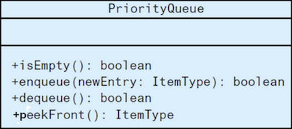
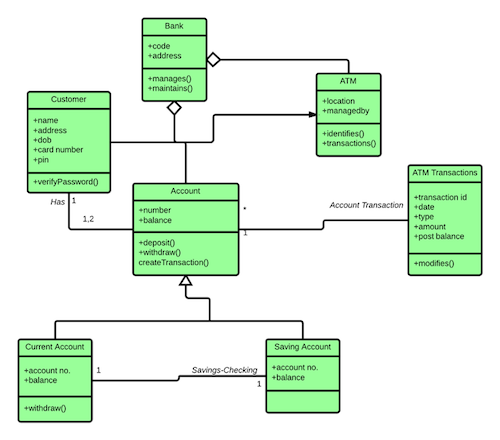
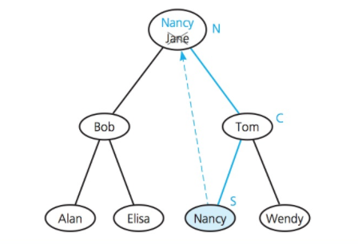
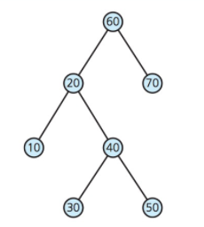
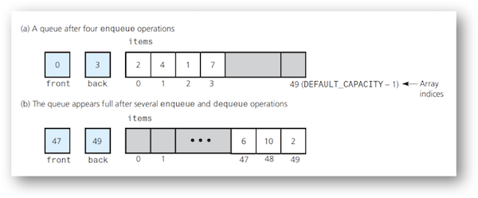
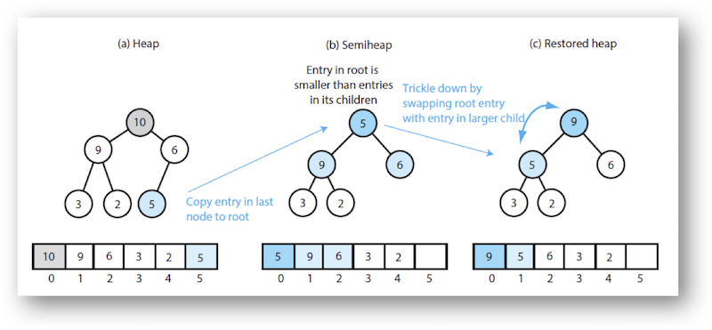
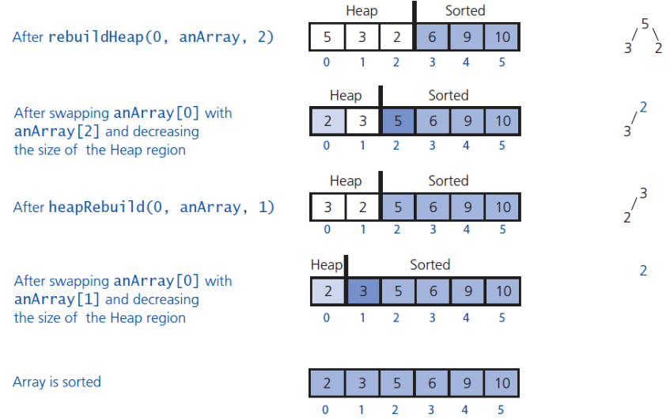

Lecture 3: BST Add - Remove - Save
===

Created By: Yusuf Pisan
---

formatted to Github Markdown syntax by Ryan Peters

## Be sure to check the other lectures out after you finish this one!

[Previous lecture][2]<------------------------------------------------------------------------>[Next lecture][3]

---

### Table of Contents
  
1. [Overview](#overview)
2. [TurtleProgram Grading Rubric](#turtleprogram-grading-rubric)
3. [UML Class Diagrams](#uml-class-diagrams)
    - [UML Class Diagrams (2)](#uml-class-diagrams-2)
4. [Huffman Coding](#huffman-coding)
5. [Binary Search Tree (BST)](#add---binary-search-tree---recursive-solution)
    - [Add - Binary Search Tree](#add---binary-search-tree---recursive-solution)
      - [Recursive Solution](#add---binary-search-tree---recursive-solution)
      - [Iterative Solution](#add---binary-search-tree---iterative-solution)
    - [Remove - Binary Search Tree](#remove---binary-search-tree)
      - [Group Exercise: Removing Nodes](#group-exercise-removing-nodes)
    - [When to use Different Traversals](#when-to-use-different-traversals)
    - [Saving BST to File or Array](#saving-bst-to-file-or-array)
    - [Tree Sort](#tree-sort)
    - [Re-Balancing a Binary Tree](#re-balancing-a-binary-tree)
6. [Queue](#queue)
    - [Priority Queue](#priority-queue)
7. [Heap](#heap)
    - [Heap - Array Based Implementation](#heap---array-based-implementation)
    - [Heap - Add](#heap---add)
    - [Heap - Remove](#heap---remove)
8. [Implementing Priority Queue as a Heap](#implementing-priority-queue-as-a-heap)
9. [BST vs Heap in Implementing Priority Queue](#bst-vs-heap-in-implementing-priority-queue)
10. [Heap Sort](#heap-sort)
11. [Ass-2: Binary Search Tree](#ass-2-binary-search-tree)
12. [After Class](#after-class)

---

### [Overview][1]

<meta name="copyright" content="Yusuf Pisan | pisan@uw.edu | http:/][1]
/courses.washington.edu/css343/"/><meta name="duration"content="120"/>

+ Review - UML, Huffman Coding, Induction (skip)
+ Technical knowledge
+ Binary Search Trees - Add, Remove, Save
+ Priority Queues
+ Binary Heaps
+ Ass-2: Binary Search Tree

---

### [TurtleProgram Grading Rubric][1]

Automated tests Wednesday 10pm and Friday 10pm

Make sure `getLength()` is defined (number of strings in array)

```
Multiple criteria. 
-5 for partially correct, -10 for not working or missing - see comments

1. private dynamically allocated array of correct size (-20)
2. Constructors: Empty, 2 parameter and Copy Constructor
3. Destructor
4. <<
5. == and !=
6. =
7. + +=
8. * *=
9. getLength
10. setIndex / getIndex
11. memory leaks
12. efficiency and complexity
13. comments.txt - tested on CSS Linux Labs
14. Coding style + ass1.zip constructed properly
```

All files must be in subdirectory called ass1: `ass1/turtleprogram.h`, `ass1/turtleprogram.cpp`, `ass1/comments.txt` and `ass1/comments.txt`

Automated tests on Wednesday 10pm and Friday 10pm from “JollyFeedback”

---

### [UML Class Diagrams][1]




---

### [UML Class Diagrams (2)][1]

From https://www.ibm.com/developerworks/rational/library/content/RationalEdge/sep04/bell/index.html
 

Savings Account inherits from Account

Account class is part of the Bank class

Account and ATM Transactions classes know each other

---

### [Huffman Coding][1]

See example at http://courses.washington.edu/css343/zander/NotesProbs/huffmanexamples

Also some good BST information on http://courses.washington.edu/css343/zander/notes.html

Let's do an example
```C++
d:4, r:6, s:6, h:6, i:7, n:7, a:8, t:9, o:8, e:13, 
```


---

### [Add - Binary Search Tree - Recursive Solution][1]

`add` calls private function `placeNode`

```C++
placeNode(subTreePtr, newNodePtr)
  Search tree for newNodePtr
  if search terminates at the left subtree of the parentNode
    set leftChildPtr of parentNode to newNodePtr
  else
    set rightChildPtr of parentNode to newNodePtr
```

refining it (see textbook)
```C++
placeNode(subTreePtr, newNodePtr)
  if subTreePtr is nullptr
    return newNodePtr
  else if subTreePtr->getItem() >  newNodePtr->getItem()
    tempPtr = placeNode(subTreePtr->getLeftChildPtr(), newNodePtr)
    subTreePtr->setLeftChildPtr(tempPtr)
  else
    tempPtr = placeNode(subTreePtr->getRightChildPtr(), newNodePtr)
    subTreePtr->setRightChildPtr(tempPtr)
  return subTreePtr
```

---

### [Add - Binary Search Tree - Iterative Solution][1]

If visiting all tree nodes, recursion is probably needed.

Add should not visit all tree nodes!

```C++
  if the rootPtr is nullptr
    set rootPtr, return
  else
    set curr to rootptr
    while not inserted
      if newNodePtr->item < curr->item
        if curr->left is nullptr
          add the new node to left
          set inserted to true
        else
          set curr to curr->left
      else
        // newNodePtr->item >= curr->item
        // same for right node
```

---

### [Remove - Binary Search Tree][1]

Find the item and if found remove it and return `true`, else return `false`

There are 3 cases to consider when removing N

1. N is a leaf - easy, set parent to nullptr

2. N has one child - ok, promote child to N's position

3. N has two children - difficult

For Case 3, we need a different strategy. 

1. Pick another node M to remove. 

2. Copy the item in M to N's location, therefore deleting the item at N.

3. Remove the node M

How can we choose M so we preserve the BST properties?

All the items in N's right subtree are greater than the item in N. Where is the smallest of these items? The leftmost branch of N's rightChild! This item is called the *inorder successor* of N



---

### [Group Exercise: Removing Nodes][1]



For each exercise below, start with the original tree above

1. Remove 50, Remove 40

2. Remove 20

3. Remove 60

---

### [When to use Different Traversals][1]

Inorder: sorted values

Preorder: clone tree, count nodes, prefix algebraic expression

Postorder: postfix algebraic notation, deleting tree

---

### [Saving BST to File or Array][1]

Save the BST using inorder traversal, we get a sorted list of items, smallest to largest.

Reading it back, we want the middle item to be the root, so

If n is odd, read n/2 items as left subtree, read root, read n/2 items as right subtree


If n is even, one subtree needs to have one extra element.

---

### [Tree Sort][1]

Add an array's entries to BST.  

Traverse BST in inorder, copy the values back to array

Additions: average O(log n), worst case O(n)  
n additions: average O(n x log n), worst case O(n^2^)  
traversal and copy: O(n)  which is smaller than both average and worst case  
tree sort: average case O(n x log n), worst case O(n^2^)  

---

### [Re-Balancing a Binary Tree][1]

What does it mean to be balanced?

AVL Trees - balanced binary search tree

https://en.wikipedia.org/wiki/Tree_rotation


We'll get to them later!

---

### [Queue][1]


FIFO - first in, first out (lunch queue, printer queue, ...)

Implementation: Linked list


Implementation: Array based (keep track of front and back indexes)



More advanced version - circular array

---

### [Priority Queue][1]


TODO Lists, Simulations

Implementation: Linked list


---

### [Heap][1]

MaxHeap: Complete binary tree whose root is greater than its children

MinHeap: ...

Not a binary search tree!


---

### [Heap - Array Based Implementation][1]


- Heap has to be complete, filled from left to right
- We know the index of each node based on level i
  - left: 2 * i + 1
  - right: 2* i + 2
  - parent: (i - 1) / 2
    
    


Keep track of `itemcount` and `maxItems`

---

### [Heap - Add][1]


- Add the new node to the next available spot

- Bubble up, swapping values with parent until Heap property restored

---

### [Heap - Remove][1]



- Remove the node, we now have 2 semiheaps
- Last node that was added to the heap, becomes root
- Trickle down, swapping root value with child value (while child value larger)

---

### [Implementing Priority Queue as a Heap][1]

Highest priority is at the root of MaxHeap


---

### [BST vs Heap in Implementing Priority Queue][1]

If we know the maximum number of items in priority queue, heap is better

Heap is blanced, BST can become unbalanced degrading performance

If multiple items have the same priority, we can maintain a list at the node

When last item in the list deleted, node is deleted

---

### [Heap Sort][1]


- Partition the array into Heap and Sorted parts
- Remove the root of the Heap, transfer it to Sorted
- Heap is smaller and has to be rebuilt. Sorted now has one more element
- Keep removing until Heap is empty




---

### [Ass-2: Binary Search Tree][1]

Implement a BST

- add, contains, inorderTraverse, getHeight, getNumberOfNodes, rebalance
- rebalance requires writing all nodes to an array and rebuilding the tree from scratch
- Adding any ItemType, using Templates. BUT, build your BST for string first and then convert!
- I will provide the menu and some basic code

```
1. Add
2. Search
3. Inorder traverse
4. Height & Number of nodes
5. Rebalance
6. Add Multiple
10. Exit
>> 6
Enter multiple strings: g k d p i c a b
Added g
Setting right child of g to k
Added k
Setting left child of g to d
Added d
Setting right child of k to p
Added p
Setting left child of k to i
Added i
Setting left child of d to c
Added c
Setting left child of c to a
Added a
Setting right child of a to b
Added b
                p
            k
                i
        g
            d
                c
                        b
                    a
1. Add
...
3. Inorder traverse
...
10. Exit
>> 3
a b c d g i k p 

1. Add
2. Search
...
10. Exit
>> 2
Enter a string: i
Found i

1. Add
...
4. Height & Number of nodes
...
10. Exit
>> 4
Height: 5
Number of nodes: 8
```

---

### [After Class][1]

- No class Monday
  - Read Priority Queues, Binary Heaps if you have not yet
- Post to slack about some technical knowledge you are proud of
- Post tips or problems with CSS Linux Lab
- Work on Assignment-1
- Work on creating Binary Search Trees
  - Start simple
- Grader: Thomas Kercheval kercht@uw.edu
  - Available for questions on Friday Jan 12, 1-2pm in front of UW1-260Q

[1]:#table-of-contents "Back to Table of Contents"
[2]:https://ryancpeters.github.io/Winter_UWB_2017/343_data-structures_n_algos/lectureNotes/lecture2/
[3]:https://ryancpeters.github.io/Winter_UWB_2017/343_data-structures_n_algos/lectureNotes/lecture4/
