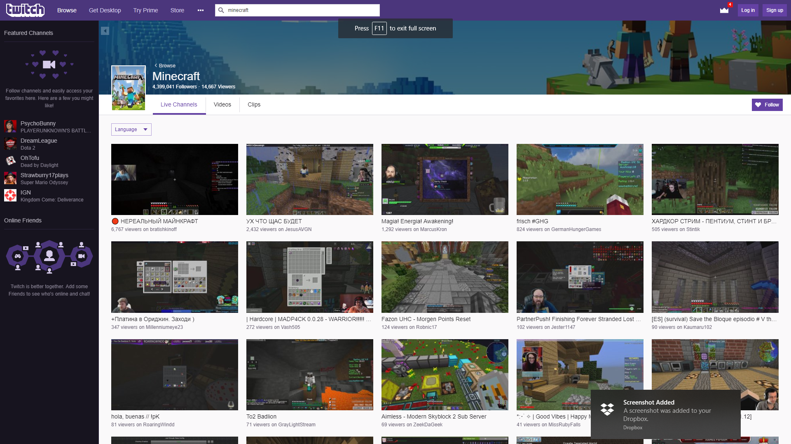

Product: **Steam Stream**
===

### In a Nutshell
_Steam Stream_ is a service that provides seamless integration of games in a player's steam library and Streaming outlets. 

##### Be it **live streaming** on _Twitch_

##### **recorded game sessions** on _YouTube Gaming_

##### or ***both*** on Microsoft's _Mixer_.

---

## Say Hello to your first, and last stop for video game streaming entertainment

_Steam Stream_ offers users an all inclusive service for finding, following and tracking all kinds of video streams for their favorite games.

#### No longer do you need to hunt down a decent streaming feed for your favorite games
_Steam Stream_ integrates your Steam library, wish-list, and the Steam Store with an active feed of top streamer footage relevant to the titles visible in your Steam-app's view portal.

---

## There's something for everybody when you use Steam Stream

_Steam Stream_ isn't just for stream viewers. In fact, the core set of features for this service are centered around improving the quality of life for stream producers! 

In the world of video game streaming, it takes more than just being good at playing a game to make for an entertaining streaming session, and while there is a fantastic opportunity for people to make a very comfortable living while doing the things they love (playing games ::smile::) 
   

First and foremost, the streamer needs to be able to effectively manage their feed and presentation as a unique brand; key to this effort is being able to acquire and manage a quality stream overlay. 

