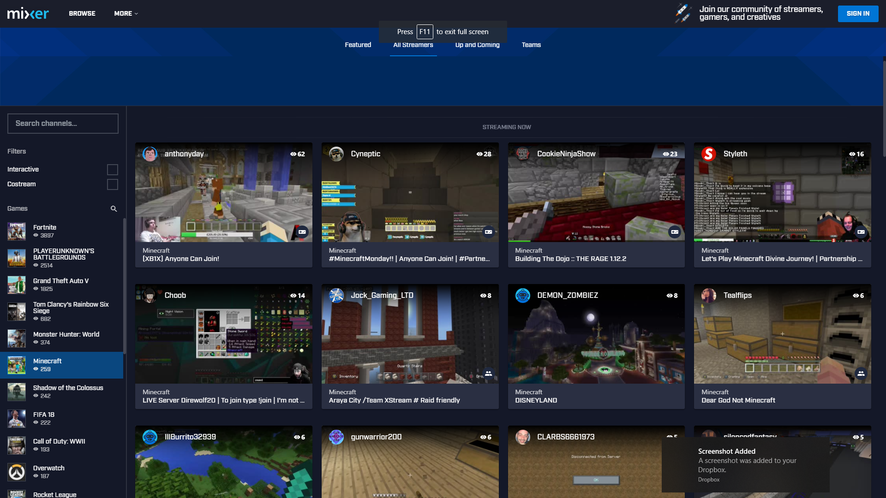

Product: **Steam Stream**
===

TL;DR
_Steam Stream_ is a service that provides seamless integration of games in a player's steam library and Streaming outlets. 

Be it **live streaming** on _Twitch_

**recorded game sessions** on _YouTube Gaming_

or ***both*** on Microsoft's _Mixer_.

No longer do you need to 
